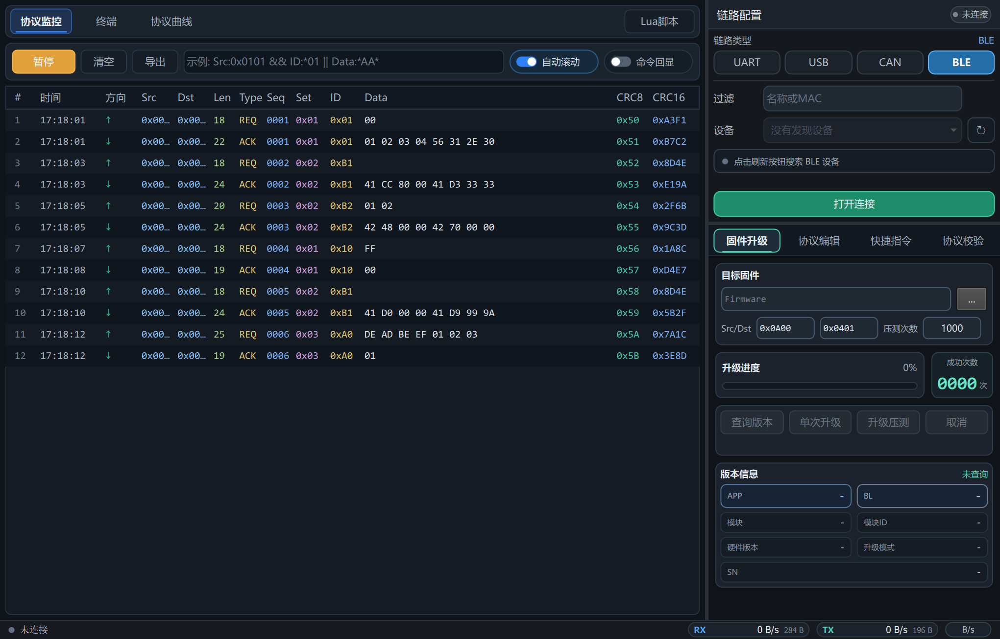
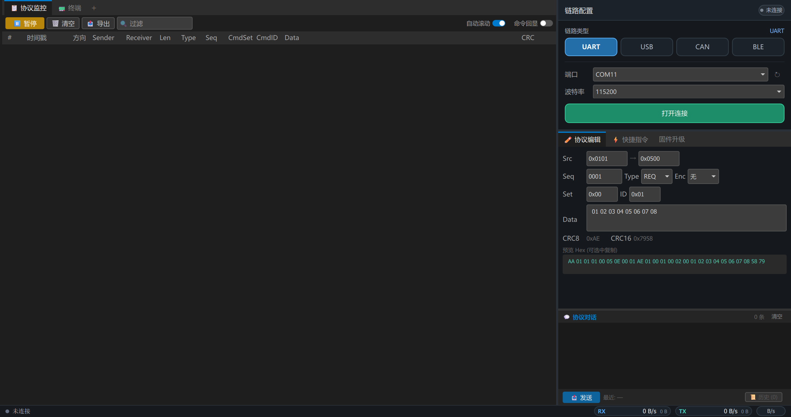
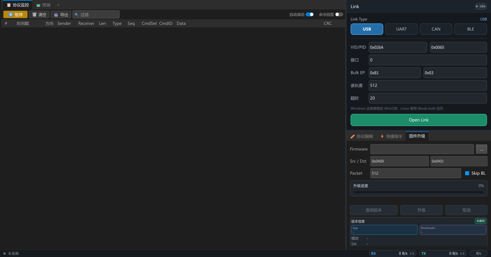
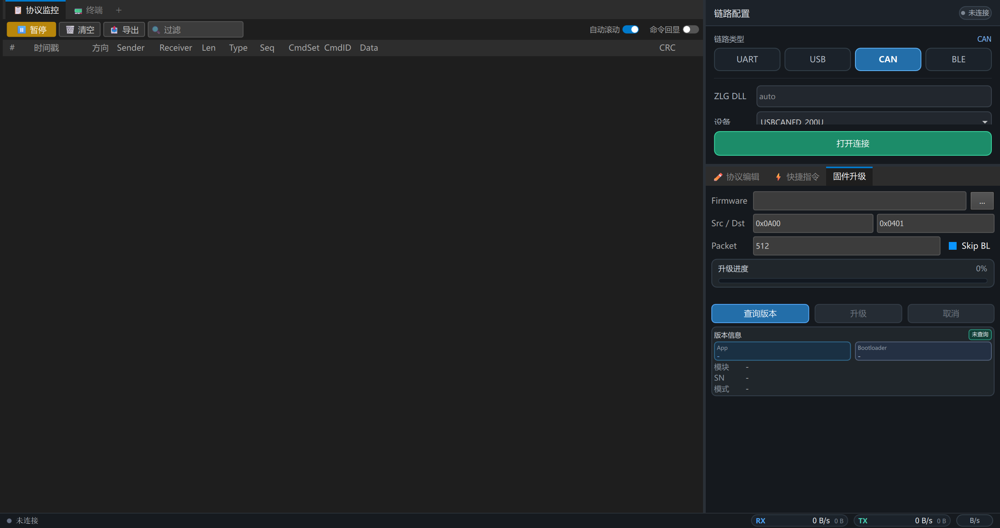

# KPtools 上位机使用说明

KPtools 是用于设备调试、链路收发、数据观察、脚本辅助和固件升级的桌面上位机工具。本文只介绍上位机的功能和使用方法，不介绍具体协议格式、命令定义或字段含义。

## 快速开始

1. 打开 `dist/KPtools.exe`。
2. 在右侧 `链路配置` 中选择通信方式：`UART`、`USB`、`CAN` 或 `BLE`。
3. 填好对应链路参数后，点击 `打开连接`。
4. 在左侧工作区查看数据，或切换到 `终端`、`协议曲线`。
5. 在右侧工具区使用 `固件升级`、`协议编辑`、`快捷指令`、`协议校验`。

## 界面区域

主界面分为三块：

- 左侧工作区：用于协议监控、终端收发、曲线观察。
- 右上链路配置：用于选择并打开 UART、USB、CAN、BLE 连接。
- 右下工具区：用于固件升级、手动编辑并发送指令、管理快捷指令、校验输入数据。
- 底部状态栏：显示连接状态、RX/TX 流量和速率单位。

窗口布局、链路类型、常用输入项、终端选项、脚本标签页等会自动保存，下次打开会尽量恢复上一次状态。

## 链路配置

### UART

UART 用于串口设备调试。

使用步骤：

1. 在 `链路类型` 中选择 `UART`。
2. 选择串口端口。
3. 设置波特率。
4. 如需调整串口参数，可设置数据位、校验位和停止位。
5. 点击 `打开连接`。

常用场景：

- 连接 USB 转串口模块。
- 调试 MCU 串口日志或串口控制链路。
- 使用终端模式发送文本或 HEX 数据。

### USB

USB 用于 USB Bulk 设备调试。

使用步骤：

1. 在 `链路类型` 中选择 `USB`。
2. 填写 `VID`、`PID`。
3. 填写接口号、Bulk IN、Bulk OUT 和读取长度。
4. Windows 下确认设备已绑定 WinUSB。
5. 点击 `打开连接`。

常用场景：

- 通过 USB Bulk 与设备直接收发数据。
- 配合固件升级功能做高速传输。
- 在监控页观察收发记录。

### CAN

CAN 用于 CAN/CAN FD 设备调试，当前界面面向 ZLG CAN 设备。

使用步骤：

1. 在 `链路类型` 中选择 `CAN`。
2. 选择设备类型、设备索引和通道。
3. 设置 TX/RX ID。
4. 选择 `CAN` 或 `CAN FD`。
5. 设置仲裁速率；CAN FD 模式下还可以设置数据速率、BRS、扩展帧等选项。
6. 点击 `打开连接`。

常用场景：

- 使用 CAN/CAN FD 适配器连接设备。
- 执行设备查询、升级等操作。
- 在协议监控表中查看收发方向、时间和数据。

### BLE

BLE 用于蓝牙低功耗设备调试。

使用步骤：

1. 在 `链路类型` 中选择 `BLE`。
2. 可在过滤框输入设备名称或 MAC 的关键字。
3. 点击刷新按钮扫描设备。
4. 在设备下拉框中选择目标设备。
5. 点击 `打开连接`。

常用场景：

- 调试 BLE 设备的无线链路。
- 无线查看协议监控数据。
- 配合协议编辑或快捷指令发送测试数据。

## 协议监控

协议监控是默认工作区，用于查看上位机和设备之间的收发记录。

主要功能：

- `暂停/继续`：停止或恢复表格刷新，便于分析当前数据。
- `清空`：清除当前监控列表。
- `导出`：用于导出当前监控数据。
- `过滤`：按输入条件筛选监控列表。
- `自动滚动`：开启后新数据到达时自动滚动到底部。
- `命令回显`：开启后可以显示上位机主动发送的命令记录。

过滤输入框支持组合条件，例如按来源、ID、数据内容等关键字筛选。这里仅作为上位机筛选功能使用，不展开字段含义。

适合场景：

- 观察设备是否有数据返回。
- 对比发送和接收的时序。
- 临时暂停列表，复制或导出当前数据。
- 快速定位特定数据记录。

## 终端

终端用于直接收发原始数据，适合不需要表格解析的调试场景。

主要功能：

- 文本发送：在输入框输入内容后点击 `发送`。
- HEX 发送：勾选 `HEX` 后按十六进制字节输入。
- 行结束符：选择发送时附加的换行方式。
- 时间戳：显示接收数据的时间。
- 回显：显示本机发送内容。
- 自动滚动：新数据到达时自动滚动到底部。
- VT100/ANSI：用于显示带控制序列或颜色的终端输出。
- 显示模式：可切换文本显示或 HEX 显示。
- 右键菜单：复制、全选、清空。

适合场景：

- 验证链路是否能收发。
- 查看设备串口日志。
- 发送简单测试数据。
- 使用 HEX 模式调试二进制数据。

## 协议曲线

协议曲线用于把接收到的数据转为趋势曲线显示，方便观察连续变化的数值。

主要功能：

- 新增曲线：添加更多曲线通道。
- 偏移设置：选择从数据中的哪个位置取值。
- 数据类型：选择按不同数值类型解释数据。
- 缩放：调整时间轴查看范围。
- 比例：对数值做倍率换算。
- 最新值：显示每条曲线的当前值。
- Lua 曲线：脚本可以主动给曲线通道推送值。

适合场景：

- 查看传感器值、状态量、控制量随时间变化。
- 调试连续采样数据。
- 用 Lua 预处理数据后再绘图。

## Lua 脚本

点击左侧工作区右上角的 `Lua脚本` 可以打开脚本编辑器。脚本用于辅助监控和自动化操作。

主要功能：

- 多标签编辑：可新建、关闭、切换脚本标签。
- 保存/加载：保存当前脚本或从文件加载脚本。
- 运行/停止：启动或停止 Lua 脚本。
- 控制台：显示 `print`、`log` 和脚本错误信息。
- 脚本回调：可在收到或发送数据时执行处理逻辑。
- 自动处理：可过滤显示、改变行颜色、自动回复、向曲线推送数据。

内置常用能力：

- `log` / `print`：输出到 Lua 控制台。
- `send`：发送数据。
- `set_timer`：设置定时任务。
- `get_timestamp`：获取时间字符串。
- `hex_to_bytes` / `bytes_to_hex`：在 HEX 字符串和字节数组之间转换。
- `read_data`：从数据中读取数值。

适合场景：

- 自动统计收发次数。
- 过滤无关数据。
- 给特定记录标色。
- 自动发送测试回复。
- 生成协议曲线需要的数值。

## 固件升级

固件升级页用于选择固件文件、查询设备版本、执行单次升级或压力升级。

使用步骤：

1. 先在 `链路配置` 中选择并打开目标链路。
2. 在 `目标固件` 中选择固件文件。
3. 检查 `Src/Dst` 等升级目标参数。
4. 点击 `查询版本`，确认设备信息能正常读取。
5. 点击 `单次升级` 执行一次升级。
6. 如需反复验证，设置 `压测次数` 后点击 `升级压测`。
7. 升级过程中可查看进度、状态、成功次数和版本信息。
8. 需要中止时点击 `取消`。

界面会显示：

- 升级进度百分比。
- 当前状态文本。
- 压测成功次数。
- APP、Bootloader、模块、模块 ID、硬件版本、升级模式、SN 等信息。

适合场景：

- 量产前验证升级流程。
- 对 USB 或 CAN 链路做升级稳定性测试。
- 快速查询设备版本和运行状态。

## 协议编辑

协议编辑页用于手动填写一条要发送的数据，并由上位机生成可发送内容。这里不展开各输入项的协议含义，只说明界面操作。

使用步骤：

1. 打开右侧工具区的 `协议编辑`。
2. 按需要填写地址、序号、类型、命令和数据输入项。
3. 查看 `预览 Hex`，确认生成内容。
4. 点击 `发送`。
5. 如果需要反复使用，点击 `加入快捷` 保存为快捷指令。
6. 点击 `历史` 可以查看最近发送记录，并一键回填表单。

界面会自动显示校验结果和发送后的回包信息，便于确认操作结果。

适合场景：

- 临时构造一条测试数据。
- 调试设备单个功能。
- 把常用输入保存成快捷指令。
- 复用历史发送记录。

## 快捷指令

快捷指令用于保存常用发送项，减少重复输入。

使用步骤：

1. 在 `协议编辑` 页填写一条常用数据。
2. 点击 `加入快捷`。
3. 输入快捷指令名称并确认。
4. 切换到 `快捷指令` 页。
5. 点击对应卡片上的 `发送`、`编辑` 或 `删除`。

快捷指令会显示名称、关键输入项和数据摘要。发送后，当前回包会显示在快捷指令页底部。

适合场景：

- 保存高频调试命令。
- 给测试人员提供固定操作入口。
- 降低手动输入错误概率。

## 协议校验

协议校验页用于粘贴一段十六进制数据并让上位机解析和检查。

使用步骤：

1. 打开右侧工具区的 `协议校验`。
2. 在输入框粘贴 HEX 数据。
3. 点击 `解析`。
4. 查看结果状态：等待输入、协议正确或协议错误。
5. 查看解析出的概要信息和校验结果。
6. 点击 `清空` 可重新输入。

适合场景：

- 检查复制来的数据是否完整。
- 快速确认校验是否通过。
- 对照监控记录定位输入错误。

## 数据与配置保存

应用会保存常用配置，减少下次打开时的重复操作。

会保存的内容包括：

- 窗口大小和布局比例。
- 上次选择的链路类型。
- UART、USB、CAN、BLE 的部分配置。
- 协议编辑页的常用输入。
- 终端显示模式、时间戳、回显、自动滚动等选项。
- Lua 编辑器打开的标签页。
- 快捷指令配置。

快捷指令默认保存在程序目录的 `config/quick_commands.json` 中。修改快捷指令后，文件会自动更新。

## 常见问题

### 打不开连接

检查以下项目：

- 设备是否已经插入或上电。
- UART 端口是否被其他软件占用。
- USB 设备是否绑定了正确驱动。
- CAN 适配器驱动和 DLL 是否可用。
- BLE 设备是否处于可扫描或可连接状态。
- 右侧链路类型是否选对。

### 监控页没有数据

检查以下项目：

- 底部状态栏是否显示已连接。
- 设备是否正在发送数据。
- 是否开启了过滤条件导致数据被隐藏。
- 是否按下了 `暂停`。
- 是否切到了 `终端` 模式，导致当前显示区域不是监控表。

### 固件升级按钮不可用

常见原因：

- 还没有打开连接。
- 还没有选择固件文件。
- 当前正在升级，按钮会被锁定。
- 链路配置不完整。

### HEX 发送提示异常

检查输入是否按字节书写，例如每个字节使用两位十六进制字符。空格可以用于分隔字节。

### 快捷指令没有显示

检查 `config/quick_commands.json` 是否存在，或当前程序目录是否有写入权限。

## 使用建议

- 调链路先用 `终端` 做简单收发确认，再使用协议监控和右侧工具。
- 调单条数据先用 `协议编辑`，确认无误后再加入快捷指令。
- 调连续数值先用 `协议监控` 确认数据存在，再切换到 `协议曲线`。
- 做升级压测前先执行一次 `查询版本` 和一次 `单次升级`。
- Lua 脚本建议从默认脚本改起，先观察控制台输出，再逐步增加自动处理逻辑。
